## 1. Project Overview

**HelixEMR** is a production-grade, full-stack **Electronic Medical Record (EMR) system** engineered for modern healthcare facilities. Built on a **Java 21 + Spring 6 + Hibernate 6** technology stack and containerised with **Docker + Apache Tomcat 11**, it delivers a complete clinical workflow platform — from patient registration to encounter management, order tracking, and clinical reporting.

### Application Dashboard

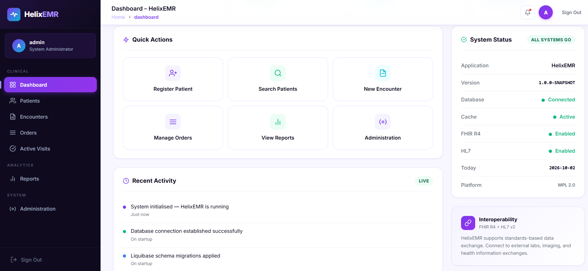

*HelixEMR application running successfully through the AWS deployment.*

### At a Glance

| Attribute | Value |
|---|---|
| **Project Name** | HelixEMR |
| **Organisation** | Helix Health |
| **Version** | 1.0.0-SNAPSHOT |
| **Language** | Java 21 |
| **Architecture** | Multi-module Maven · MVC · Layered |
| **Deployment** | Docker · Apache Tomcat 11 |
| **Database** | MariaDB 10.11 |
| **License** | Mozilla Public License 2.0 |
| **Context Path** | `/helixemr` |

### Target Users

- **Clinicians** — record patient encounters, observations, and orders
- **Registration Clerks** — enrol and manage patient demographics
- **Administrators** — manage users, system configuration, and audits
- **Facility Managers** — access clinical and operational reports
- **DevOps / Platform Engineers** — deploy, monitor, and scale the platform

### Business Value

HelixEMR eliminates paper-based clinical workflows, reduces transcription errors, enables real-time patient data access across departments, and provides a standards-compliant (FHIR R4, HL7) foundation for healthcare interoperability. It is architected to be deployable in any environment — on-premise, cloud, or hybrid — using standard containerisation tooling.

---

## 2. Business Problem

### The Challenge

Healthcare facilities operating without a unified EMR face compounding operational and clinical risks:

- **Fragmented Patient Data** — Records spread across paper, spreadsheets, and siloed tools make holistic patient views impossible.
- **Medication and Allergy Errors** — Without a centralised record, clinicians lack visibility into prior prescriptions, allergies, and adverse reactions.
- **Inefficient Workflows** — Manual registration, paper-based encounter notes, and physical order slips introduce delays and bottlenecks.
- **Compliance Gaps** — Absence of digital audit trails makes regulatory compliance (HIPAA, country-specific regulations) difficult to demonstrate.
- **No Interoperability** — Isolated systems cannot communicate with labs, pharmacies, imaging centres, or national health exchanges.

### Business Impact

| Problem | Business Impact |
|---|---|
| Paper-based records | Slow retrieval, physical loss risk, no concurrent access |
| Manual patient tracking | Clinical errors from outdated or unavailable information |
| No audit logging | Liability exposure and compliance failure |
| No FHIR/HL7 support | Exclusion from national health information exchanges |
| Siloed departmental data | Duplicate tests, contradictory treatments, higher costs |

### Why HelixEMR

HelixEMR was designed as a clinically sound, standards-based EMR that any facility team can deploy and own. It provides the full patient lifecycle — registration to encounter to order to visit — backed by a robust relational data model and a modern web interface, all deployable with a single `docker compose up` command.

---

## 3. Objectives

### Primary Objectives

- Provide a unified, browser-based clinical workstation for all facility roles
- Enable full patient lifecycle management from registration to discharge
- Maintain a complete, tamper-evident audit trail of all clinical actions
- Deliver a deployable, production-ready system via Docker with zero manual server configuration

### Technical Objectives

- Implement a clean **layered architecture**: Controller → Service → DAO → Database
- Apply **Spring Security 6** with CSRF protection, CSP headers, and session management
- Use **Liquibase** for version-controlled, reproducible database migrations
- Achieve **FHIR R4 and HL7** readiness in the configuration layer
- Support **horizontal scalability** through stateless application design
- Establish a **CI/CD pipeline** with automated build, test, security scanning, and Docker publication

### Business Objectives

- Reduce patient registration time from minutes to seconds
- Eliminate paper encounter records in clinical workflows
- Enable multi-user concurrent access with role-based data segregation
- Provide exportable clinical and operational reports for facility management

---

## 4. Key Features

### Core Clinical Features

| Feature | Description | Business Benefit |
|---|---|---|
| **Patient Registration** | Full demographic capture (name, DOB, gender, MRN, allergy status) with UUID-based deduplication | Eliminates duplicate records; single source of truth |
| **Patient Search** | Real-time search by name, MRN, or identifier with paginated results | Rapid patient retrieval at point of care |
| **Patient Dashboard** | Individual patient view with demographics, audit trail, and status | Complete longitudinal patient view for clinicians |
| **Encounter Management** | Record and retrieve clinical encounters by type, date, and provider | Structured clinical documentation replacing paper notes |
| **Active Visit Tracking** | Real-time queue of checked-in and consulting patients with status breakdown | Operational visibility for front-desk and clinical staff |
| **Order Management** | Lab, radiology, medication, and procedure order tracking with type-based filtering | Reduces missed orders and tracks fulfilment status |
| **Clinical Reporting** | Six report categories: patient stats, encounter summary, visit analytics, order fulfilment, lab results, audit log | Data-driven facility management and compliance reporting |
| **System Administration** | User management, system settings, integrations, and runtime diagnostics | Centralised platform control without shell access |

### Advanced Platform Features

| Feature | Description |
|---|---|
| **Schema Versioning** | Liquibase-managed changelogs across 5 migration files covering 25+ tables |
| **Service Registry** | `ServiceContext` singleton registry wiring 20 clinical services |
| **Transactional Service Layer** | `@Transactional` with read-only optimisation on query methods |
| **JPA / Hibernate ORM** | Entity mapping with `hbm2ddl=update` and `MariaDBDialect` |
| **Multi-module Maven BOM** | 7 Maven modules with centralised version management |
| **Internationalisation** | Locale support for 9 languages (en_US, es, fr, de, pt, ar, zh, hi, sw) |

### Security Features

| Feature | Description |
|---|---|
| **BCrypt-12 Password Hashing** | Adaptive cost factor BCrypt resistant to brute-force attacks |
| **CSRF Protection** | Token-per-session CSRF filter on all state-changing endpoints |
| **Content Security Policy** | Strict CSP headers restricting script, style, image, and font origins |
| **Session Management** | Maximum 3 concurrent sessions, automatic expiry, cookie invalidation on logout |
| **Audit Log Table** | `helix_audit_log` records user, patient, action, IP, and timestamp |
| **Account Lockout** | 5 failed attempts triggers 15-minute lockout |

---

## 5. Architecture

### System Architecture

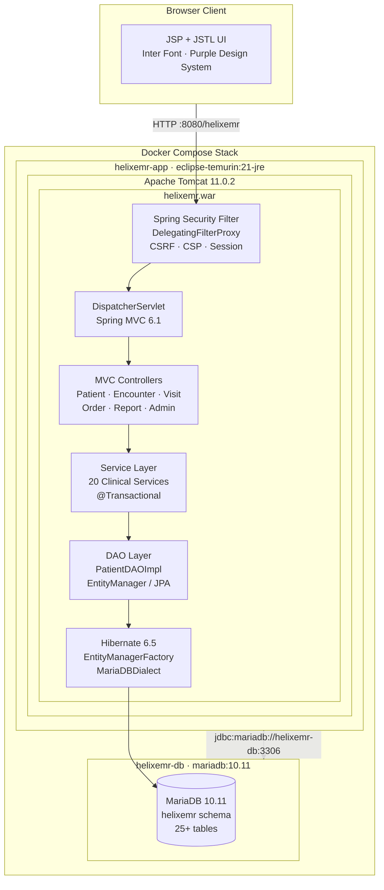

### Module Architecture

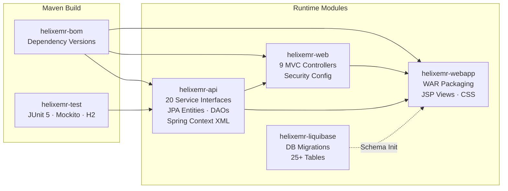

### Request Flow

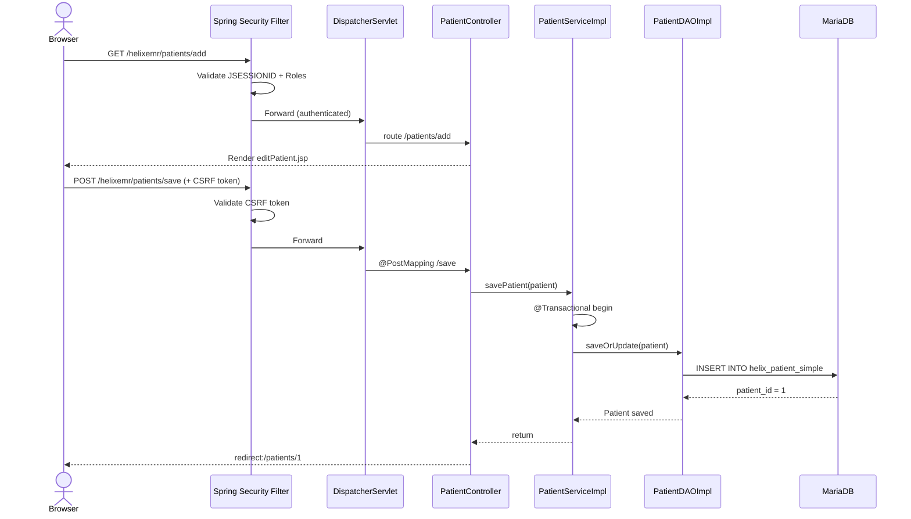

### Application Layers

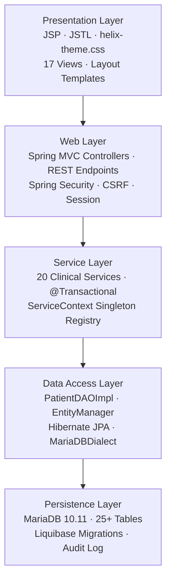

---

## 6. Tech Stack

### Backend

| Technology | Version | Purpose |
|---|---|---|
| Java | 21 | Primary language; virtual threads, records, pattern matching |
| Spring Framework | 6.1.14 | IoC container, MVC, ORM integration, transaction management |
| Spring MVC | 6.1.14 | HTTP request handling, view resolution, REST endpoints |
| Spring Security | 6.3.3 | Authentication, authorisation, CSRF, CSP, session management |
| Hibernate ORM | 6.5.3.Final | JPA provider; entity mapping, JPQL queries, DDL generation |
| Jackson | 2.17.2 | JSON serialisation for REST endpoints |
| Log4j2 + SLF4J | 2.24.1 / 2.0.16 | Structured application logging |
| Liquibase | 4.29.2 | Version-controlled database schema migrations |
| EHCache | 3.10.8 (jakarta) | Application-level second-level caching |
| C3P0 | 0.10.1 | JDBC connection pooling |
| Commons Lang3 | 3.17.0 | Utility functions for strings, encoding |

### Frontend

| Technology | Version | Purpose |
|---|---|---|
| JSP + JSTL | Jakarta EE 6.0 | Server-side view templating |
| helix-theme.css | Custom v2.0 | Purpose-built design system with CSS custom properties |
| Inter (Google Fonts) | — | Primary UI typeface |
| JetBrains Mono | — | Monospace font for MRNs, UUIDs |
| jQuery | 3.7.1 slim | DOM utilities and AJAX |
| Inline SVG Icons | — | Zero-dependency iconography |

### Database & DevOps

| Technology | Version | Purpose |
|---|---|---|
| MariaDB | 10.11 | Primary relational database |
| H2 Database | 2.3.232 | In-memory database for tests |
| Docker | 24+ | Application containerisation |
| Docker Compose | v2 | Local stack orchestration |
| Apache Tomcat | 11.0.2 | Jakarta EE Servlet 6.0 runtime |
| Eclipse Temurin | 21-jre-jammy | Minimal JRE base image |
| Maven | 3.9+ | Multi-module build and dependency management |
| GitHub Actions | — | CI/CD pipeline |
| CodeQL | — | Static security analysis |
| JaCoCo | 0.8.12 | Code coverage reporting |
| SpotBugs | 4.8.6.4 | Static code analysis |

---

## 7. Folder Structure

```text
helixemr-aws-devops/
├── .github/
│   └── workflows/
│       ├── build.yml          # CI: build, unit tests, integration tests, CodeQL, Docker
│
├── docs/
│   └── screenshots/
│       ├── aws-architecture.png
│       ├── github-actions-pipeline.png
│       ├── ecs-service-health.png
│       ├── ecr-repository.png
│       ├── alb-health-check.png
│       ├── cloudwatch-logs.png
│       └── helixemr-dashboard.png
│
├── terraform/
│   ├── provider.tf
│   ├── variables.tf
│   ├── data.tf
│   ├── networking.tf
│   ├── security_groups.tf
│   ├── alb.tf
│   ├── ecs_cluster.tf
│   ├── ecs_service.tf
│   ├── ecs_task_definition.tf
│   ├── rds.tf
│   ├── iam_ecs.tf
│   └── cloudwatch.tf
|
├── api/                       # Core API module (JAR)
│   ├── src/main/java/io/helixhealth/emr/
│   │   ├── api/               # 20 service interfaces + PatientDAOImpl
│   │   │   ├── context/       # ServiceContext singleton + Context static accessor
│   │   │   ├── db/            # DAO interfaces + implementations
│   │   │   └── impl/          # 20 @Transactional service implementations
│   │   └── patient/           # Patient JPA entity -> helix_patient_simple
│   └── src/main/resources/
│       ├── applicationContext-service.xml   # DataSource, EMF, TxManager, service beans
│       └── io/helixhealth/emr/api/
│           └── helixemr.properties          # Application configuration properties
│
├── bom/                       # Bill of Materials POM - centralised versions
├── tools/                     # Build utilities
├── test/                      # Shared test infrastructure - JUnit 5, Mockito, H2
│
├── web/                       # Web layer module (JAR)
│   └── src/main/java/io/helixhealth/emr/web/
│       ├── HelixWebConfig.java          # MVC: view resolver, Jackson, resources
│       ├── HelixSecurityConfig.java     # Security: auth, CSRF, CSP, session, headers
│       └── controller/
│           ├── DashboardController.java
│           ├── PatientController.java
│           ├── PatientRestController.java
│           ├── EncounterController.java
│           ├── VisitController.java
│           ├── OrderController.java
│           ├── ReportController.java
│           └── AdminController.java
│
├── webapp/                    # Deployable WAR module
│   └── src/main/webapp/
│       ├── WEB-INF/
│       │   ├── web.xml        # Servlet 6.0 descriptor
│       │   └── view/          # 17 JSP templates
│       │       ├── layouts/   # layout-top.jsp, layout-bottom.jsp
│       │       ├── dashboard/ # index.jsp
│       │       ├── patient/   # patientList, patientDashboard, editPatient
│       │       ├── encounter/ # encounterList.jsp
│       │       ├── visit/     # visitList.jsp
│       │       ├── order/     # orderList.jsp
│       │       ├── report/    # reportList.jsp
│       │       ├── admin/     # adminDashboard.jsp
│       │       └── auth/      # login.jsp
│       └── static/css/
│           └── helix-theme.css   # Design system: tokens, sidebar, cards, forms
│
├── liquibase/                 # Database migration module
│   └── src/main/resources/liquibase/changelog/
│       ├── db.changelog-master.xml
│       ├── db.changelog-1.0-baseline.xml    # Person, Location, Global Properties
│       ├── db.changelog-1.0-core-tables.xml # Patient, Concept, Provider, Visit
│       ├── db.changelog-1.0-clinical.xml    # Encounter, Obs, Condition
│       ├── db.changelog-1.0-security.xml    # Users, Roles, Privileges, Audit Log
│       └── db.changelog-1.0-seed-data.xml   # Default roles, locations, properties
│
├── Dockerfile                 # Multi-stage: builder (JDK 21) -> runtime (JRE + Tomcat 11)
├── docker-compose.yml         # Full stack: app + db + volumes + network
└── pom.xml                    # Root POM: Java 21, all modules, plugin management
```

---

## 8. Database Design

### Overview

HelixEMR uses **MariaDB 10.11** managed entirely through **Liquibase 4.29.2** changelogs. The schema spans 5 migration layers and **25+ tables** covering the complete clinical domain. The active JPA entity maps to `helix_patient_simple` — a standalone table that avoids the FK dependency on `helix_person` during the bootstrap phase.

### Entity Relationship Diagram

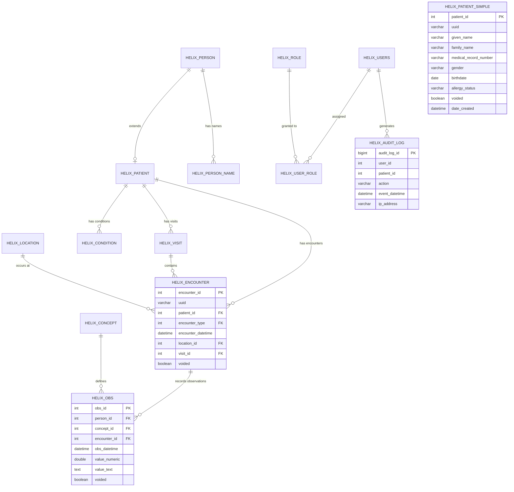

### Table Inventory

| Table | Module | Purpose |
|---|---|---|
| `helix_global_property` | Baseline | Application-wide key-value configuration |
| `helix_person` | Baseline | Base demographic record |
| `helix_person_name` | Baseline | Structured name records |
| `helix_location` | Baseline | Physical facility locations |
| `helix_patient` | Core | Patient enrolment linked to helix_person |
| `helix_patient_simple` | Runtime (JPA) | Standalone patient entity used by application layer |
| `helix_concept` | Core | Medical concept dictionary |
| `helix_provider` | Core | Clinical provider registry |
| `helix_visit_type` | Core | Configurable visit categories |
| `helix_visit` | Core | Active and historical patient visits |
| `helix_encounter_type` | Clinical | Encounter category definitions |
| `helix_encounter` | Clinical | Clinical encounter records |
| `helix_obs` | Clinical | Structured clinical observations |
| `helix_condition` | Clinical | Diagnosed conditions |
| `helix_users` | Security | System user accounts |
| `helix_role` | Security | Role definitions |
| `helix_user_role` | Security | User-to-role assignment |
| `helix_privilege` | Security | Granular privilege definitions |
| `helix_audit_log` | Security | Tamper-evident action log |

### Database Configuration

```properties
helixemr.db.url=jdbc:mariadb://helixemr-db:3306/helixemr?useUnicode=true&characterEncoding=UTF-8&serverTimezone=UTC
helixemr.db.user=helixemr
helixemr.db.driver=org.mariadb.jdbc.Driver
hibernate.hbm2ddl.auto=update
hibernate.dialect=org.hibernate.dialect.MariaDBDialect
```

---

## 9. API Documentation

### Endpoint Categories

HelixEMR exposes two categories of endpoints:

- **MVC Endpoints** — HTML views served via Spring MVC + JSP
- **REST Endpoints** — JSON responses under `/api/**`

### MVC Endpoints

| Method | Path | Controller | Description |
|---|---|---|---|
| `GET` | `/` | DashboardController | Redirect to dashboard |
| `GET` | `/dashboard` | DashboardController | Main dashboard with stats |
| `GET` | `/login` | DashboardController | Login page |
| `POST` | `/loginServlet` | Spring Security | Authenticate user |
| `POST` | `/logout` | Spring Security | Invalidate session |
| `GET` | `/health/alive` | DashboardController | Application liveness check |
| `GET` | `/patients` | PatientController | Paginated patient list |
| `GET` | `/patients/add` | PatientController | Patient registration form |
| `POST` | `/patients/save` | PatientController | Persist patient record |
| `GET` | `/patients/{patientId}` | PatientController | Individual patient dashboard |
| `GET` | `/encounters` | EncounterController | Encounter list view |
| `GET` | `/visits` | VisitController | Active visit queue |
| `GET` | `/orders` | OrderController | Clinical orders view |
| `GET` | `/reports` | ReportController | Reports and analytics |
| `GET` | `/admin` | AdminController | System administration |

### REST API Endpoints

| Method | Path | Description | Response |
|---|---|---|---|
| `GET` | `/api/patients/search?q={query}&start={n}&size={n}` | Search patients by name or MRN | `JSON Array<Patient>` |
| `GET` | `/api/patients/{patientId}` | Get single patient by ID | `JSON Patient` or `404` |

### Response Example — Patient Object

```json
{
  "patientId": 1,
  "uuid": "a1b2c3d4-e5f6-7890-abcd-ef1234567890",
  "givenName": "John",
  "familyName": "Smith",
  "medicalRecordNumber": "HX-00001",
  "gender": "M",
  "birthdate": "1985-06-15",
  "allergyStatus": "No Known Allergies",
  "voided": false,
  "dateCreated": "2026-06-12T13:45:00"
}
```

### Error Responses

| Status | Scenario |
|---|---|
| `302` | Unauthenticated request redirected to `/login` |
| `403` | Invalid CSRF token or expired session redirected to `/login?sessionExpired=true` |
| `404` | Patient not found or unmapped path |
| `500` | Unhandled server exception with styled error page |

---

## 10. Security Implementation

### Authentication

Spring Security 6.3 with form-based authentication backed by `InMemoryUserDetailsManager`.

```
Username: admin
Password: Admin1234!
Roles:    ROLE_ADMIN, ROLE_USER
```

### Password Security

- **Algorithm:** BCrypt with cost factor **12** — 4096 hash iterations
- **Lockout:** 5 failed attempts triggers 15-minute account lockout

### Session Management

```
Max concurrent sessions:  3
Timeout:                  30 minutes of inactivity
Cookie name:              HELIX_SESSION
HttpOnly:                 true (no JavaScript access)
Expiry action:            Redirect to /login?sessionExpired=true
```

### HTTP Security Headers

| Header | Value | Protection |
|---|---|---|
| `Content-Security-Policy` | `default-src 'self'; script-src 'self' 'unsafe-inline'` | XSS prevention |
| `X-Frame-Options` | `SAMEORIGIN` | Clickjacking prevention |
| `Referrer-Policy` | `STRICT_ORIGIN_WHEN_CROSS_ORIGIN` | Referrer leakage prevention |

### Authorisation Rules

```
/login, /loginServlet, /health/**, /static/**, /images/**  ->  Public
/api/**                                                     ->  Authenticated
/**                                                         ->  Authenticated
```

### OWASP Top 10 Mitigations

| Risk | Mitigation |
|---|---|
| A01 Broken Access Control | Spring Security authorisation on all paths |
| A02 Cryptographic Failures | BCrypt-12 passwords; HTTPS-ready |
| A03 Injection | JPA parameterised queries — no string-concatenated SQL |
| A05 Security Misconfiguration | CSP, X-Frame-Options, Referrer-Policy headers on all responses |
| A07 Auth Failures | Account lockout, session expiry, CSRF protection |
| A09 Logging Failures | `helix_audit_log` records IP, user, action, and timestamp on every event |

---

## 11. CI/CD Pipeline

The repository uses **GitHub Actions** to automate validation, container image publishing, security analysis, and ECS deployment.

### Pipeline flow

```text
Git Push / Pull Request
        │
        ▼
┌──────────────────────────┐
│ Build & Unit Tests       │
│ Java 21 + Maven          │
└────────────┬─────────────┘
             │
             ▼
┌──────────────────────────┐
│ Integration Tests        │
│ MariaDB 10.11            │
└────────────┬─────────────┘
             │
             ├───────────────────────┐
             ▼                       ▼
┌──────────────────────────┐  ┌──────────────────────────┐
│ Docker Build & Push      │  │ Security Scan            │
│ Amazon ECR               │  │ GitHub CodeQL            │
└────────────┬─────────────┘  └──────────────────────────┘
             │
             ▼
┌──────────────────────────┐
│ Deploy to ECS Fargate    │
│ Register Task Definition │
│ Update ECS Service       │
│ Wait for Stability       │
└────────────┬─────────────┘
             │
             ▼
┌──────────────────────────┐
│ ALB Health Verification  │
│ /helixemr/health/alive   │
└──────────────────────────┘
```

### GitHub Actions jobs

The current workflow contains these jobs:

| Job | Purpose |
|---|---|
| **Build & Unit Tests** | Compiles the Java application and runs Maven verification |
| **Integration Tests** | Runs integration tests against MariaDB 10.11 |
| **Docker Build & Push to ECR** | Builds the application image and publishes both `main` and commit-SHA tags to Amazon ECR |
| **Security Scan** | Runs GitHub CodeQL analysis for Java |
| **Deploy to ECS Fargate** | Registers a new ECS task-definition revision and updates the ECS service |

### Image tagging

Images are published to:

```text
891376989557.dkr.ecr.ap-south-1.amazonaws.com/helixemr
```

The workflow uses:

```text
:main
:<commit-sha>
```

The commit-SHA tag provides immutable deployment traceability from an ECS task back to the exact Git commit.

### GitHub OIDC authentication

The workflow does **not** store long-lived AWS access keys in GitHub Actions.

Instead:

```text
GitHub Actions
      │
      │ OIDC token
      ▼
GitHubActions-HelixEMR-ECR
      │
      ├── ECR permissions
      ├── ECS deployment permissions
      └── iam:PassRole for ECS task execution role
```

The IAM trust policy restricts role assumption to this repository:

```text
Megna0710/helixemr-aws-devops
```

This demonstrates key DevSecOps practices:

- Short-lived federated credentials
- No hard-coded AWS access keys
- Repository-scoped trust policy
- Least-privilege deployment permissions

### Successful CI/CD Pipeline

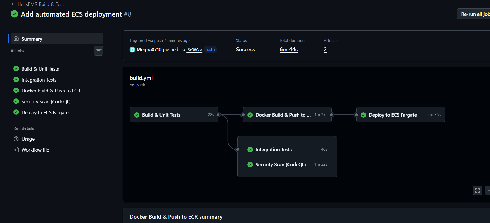

*GitHub Actions successfully builds, tests, scans, publishes the Docker image to Amazon ECR, and deploys HelixEMR to Amazon ECS Fargate.*

---

## 12. AWS Deployment Architecture

The AWS environment separates public load-balancing infrastructure, private application workloads, and private database resources.

### High-level architecture

```text
                         Internet
                            │
                            ▼
                 ┌─────────────────────┐
                 │   Application Load   │
                 │     Balancer        │
                 │      HTTP :80       │
                 └──────────┬──────────┘
                            │
                            │ HTTP :8080
                            ▼
             ┌──────────────────────────────┐
             │       ECS Fargate            │
             │     helixemr-service         │
             │                              │
             │  ┌────────────────────────┐  │
             │  │ HelixEMR Container      │  │
             │  │ Tomcat / Spring / Java  │  │
             │  │ Port 8080               │  │
             │  └────────────────────────┘  │
             └──────────────┬───────────────┘
                            │
                            │ TCP :3306
                            ▼
             ┌──────────────────────────────┐
             │        Amazon RDS            │
             │       MariaDB 10.11          │
             │      Private Subnets         │
             └──────────────────────────────┘

       GitHub Actions
             │
             ├── OIDC → IAM Role
             │
             ▼
          Amazon ECR
             │
             ▼
       ECS Task Definition
             │
             ▼
       ECS Fargate Service
```

### AWS Deployment Architecture

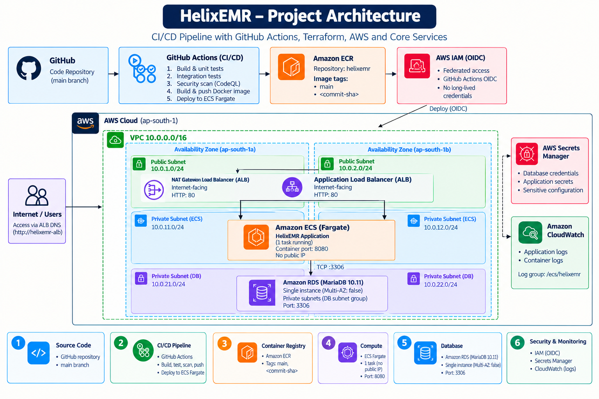

### AWS resources

| Layer | AWS resource | Purpose |
|---|---|---|
| Networking | VPC `10.0.0.0/16` | Isolated application network |
| Networking | Internet Gateway | Internet access for public resources |
| Networking | Public subnets | ALB placement |
| Networking | Private ECS subnets | Fargate application tasks |
| Networking | Private DB subnets | RDS placement |
| Networking | NAT Gateway | Outbound access for private ECS tasks |
| Load balancing | Application Load Balancer | Public HTTP entry point |
| Compute | ECS Fargate | Serverless container runtime |
| Container registry | Amazon ECR | Stores HelixEMR images |
| Database | Amazon RDS MariaDB | Persistent application database |
| Secrets | AWS Secrets Manager | Database/admin password retrieval |
| Logging | Amazon CloudWatch Logs | ECS application logs |
| Identity | IAM + GitHub OIDC | Secure CI/CD authentication |
| IaC | Terraform | Infrastructure management |

### ECS Fargate Service Health

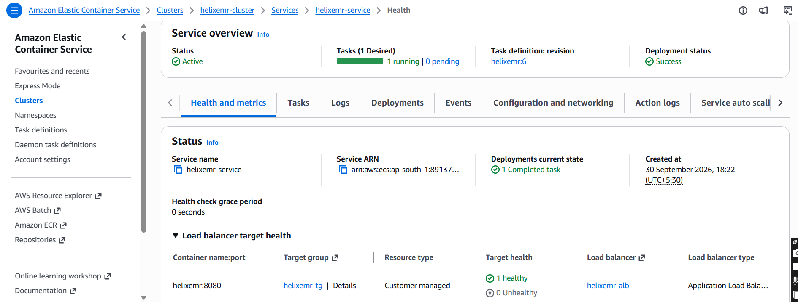

*HelixEMR is running on ECS Fargate with a healthy ALB target.*

### Amazon ECR

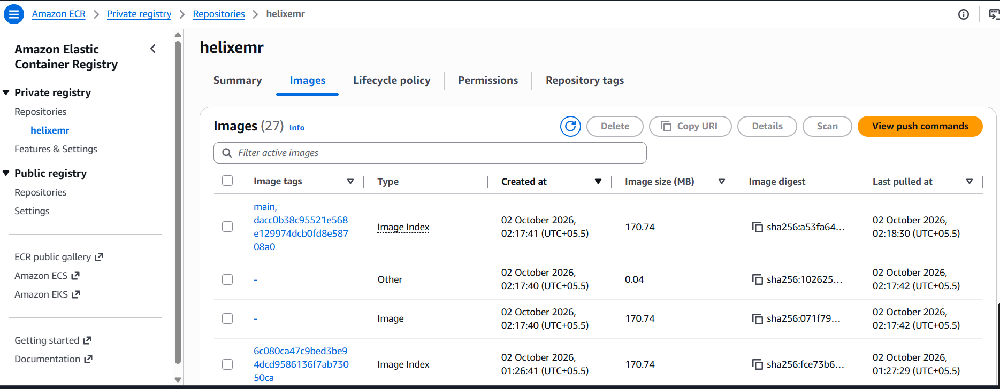

*HelixEMR container images are stored in Amazon ECR using the `main` branch and Git commit SHA tags.*

### Network segmentation

The VPC is divided into three subnet tiers:

```text
10.0.0.0/16
│
├── Public
│   ├── 10.0.1.0/24  ap-south-1a
│   └── 10.0.2.0/24  ap-south-1b
│
├── ECS Private
│   ├── 10.0.11.0/24 ap-south-1a
│   └── 10.0.12.0/24 ap-south-1b
│
└── Database Private
    ├── 10.0.21.0/24 ap-south-1a
    └── 10.0.22.0/24 ap-south-1b
```

The ECS service does not receive a public IP. Traffic enters through the ALB and reaches the Fargate task on port `8080`.

### Security-group flow

```text
Internet
   │
   │ TCP 80
   ▼
ALB Security Group
   │
   │ TCP 8080
   ▼
ECS Security Group
   │
   │ TCP 3306
   ▼
RDS Security Group
```

This limits database access to the ECS security group rather than exposing MariaDB publicly.

### Application Load Balancer health check

The target group checks:

```text
GET /helixemr/health/alive
```

A successful response is:

```json
{
  "status": "UP",
  "application": "HelixEMR",
  "version": "1.0.0"
}
```

---

## 13. Infrastructure as Code — Terraform

Terraform is used to manage the AWS infrastructure while preserving the existing application environment.

### Terraform configuration

The Terraform configuration includes:

- AWS provider
- VPC and networking
- Public and private subnets
- Route tables and associations
- NAT Gateway and Elastic IP
- Security groups
- Application Load Balancer
- Target group and listener
- ECS cluster
- ECS service
- ECS task definition
- RDS subnet group
- RDS MariaDB instance
- IAM execution role and policies
- GitHub Actions deployment policy
- CloudWatch log group

### Terraform workflow

```text
Existing AWS Resources
        │
        ▼
   Inspect / Verify
        │
        ▼
   Write Terraform
        │
        ▼
   terraform import
        │
        ▼
   terraform plan
        │
        ▼
     No Drift
```

The infrastructure was reconciled against the existing AWS resources instead of destroying and recreating them.

### Safe Terraform operating model

Before changing infrastructure:

```powershell
terraform init
terraform validate
terraform plan
```

Review the plan before applying changes:

```powershell
terraform apply
```

For this project, imported resources were intentionally reconciled to a **no-change** Terraform plan before moving on.

### Important CI/CD boundary

The ECS service is deployed by GitHub Actions. The ECS service Terraform resource therefore ignores task-definition revision changes:

```hcl
lifecycle {
  ignore_changes = [
    task_definition
  ]
}
```

This prevents Terraform from attempting to roll the ECS service back to an older task-definition revision every time CI/CD publishes a new image.

---

## 14. Installation & Local Development

### Prerequisites

Install:

- Java 21
- Maven
- Docker Desktop
- Git
- AWS CLI
- Terraform
- VS Code or another IDE

Verify the main tools:

```powershell
java -version
mvn -version
docker --version
git --version
aws --version
terraform version
```

### Clone the repository

```powershell
git clone https://github.com/Megna0710/helixemr-aws-devops.git
cd helixemr-aws-devops
```

### Run locally with Docker Compose

Build and start the application:

```powershell
docker compose up --build -d
```

The application is available at:

```text
http://localhost:8080/helixemr
```

The local database container listens on container port `3306`. The host-side mapping uses `3307:3306` because a local Windows MySQL service may already occupy host port `3306`.

### Check containers

```powershell
docker ps
```

### Stop the local environment

```powershell
docker compose down
```

Avoid removing persistent database volumes unless you intentionally want to delete the local database data.

### Local configuration

Use `.env.example` as the reference for environment variables. Do not commit real credentials, passwords, AWS keys, Terraform state, or other secrets.

### Local demo credentials

The application README documents the local demo account:

```text
Username: admin
Password: Admin1234!
```

These credentials are for local/demo use only and must not be reused as production credentials.

---

## 15. Deployment & Verification

### Deployment path

A change pushed to `main` follows this path:

```text
Developer
   │
   ▼
GitHub
   │
   ▼
GitHub Actions
   │
   ├── Maven build
   ├── Unit tests
   ├── Integration tests
   ├── CodeQL
   └── Docker build
          │
          ▼
       Amazon ECR
          │
          ▼
    ECS task definition
          │
          ▼
    ECS Fargate service
          │
          ▼
      ALB target
          │
          ▼
     Health endpoint
```

### Deployment verification

Check the ECS service:

```powershell
aws ecs describe-services `
  --cluster helixemr-cluster `
  --services helixemr-service `
  --query "services[0].{Status:status,Desired:desiredCount,Running:runningCount,Pending:pendingCount,TaskDefinition:taskDefinition}" `
  --output table
```

Check the ALB health endpoint:

```powershell
curl.exe -i http://helixemr-alb-920014316.ap-south-1.elb.amazonaws.com/helixemr/health/alive
```

Expected response:

```text
HTTP/1.1 200 OK
```

with:

```json
{
  "status": "UP",
  "application": "HelixEMR",
  "version": "1.0.0"
}
```

### Application Health Verification

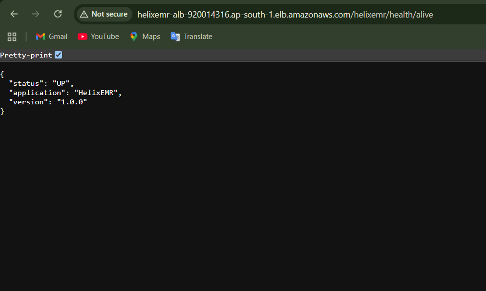

*The Application Load Balancer successfully routes traffic to the healthy HelixEMR ECS task.*

### CloudWatch logs

ECS application logs are written to:

```text
/ecs/helixemr
```

This provides a central location for diagnosing application startup, database connectivity, and runtime issues.


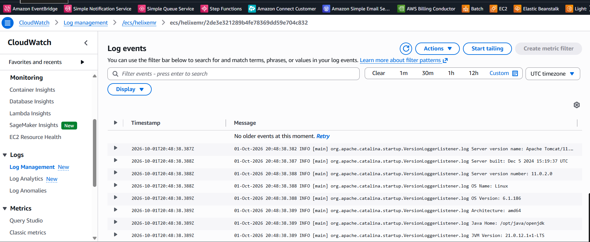

*HelixEMR ECS application logs are centralized in Amazon CloudWatch Logs.*

### Deployment traceability

Every CI/CD deployment uses the Git commit SHA as an ECR image tag. This makes it possible to identify which source revision produced the container currently deployed to ECS.

---

## 16. Challenges & Learnings

### Application-level challenges

The project involved troubleshooting:

- Spring Security context wiring
- CSRF-aware authentication
- `AntPathRequestMatcher` behavior
- EHCache SSL certificate issues
- JPA/Hibernate persistence configuration
- `@PathVariable` parameter handling
- Foreign-key constraints versus JPA automatic schema generation
- Database connectivity across Docker and AWS environments

### AWS / DevOps challenges

Additional infrastructure and deployment work included:

- Migrating database configuration from local Docker hostnames to environment-driven configuration
- Connecting ECS Fargate privately to RDS
- Configuring ALB health checks for a WAR-based Tomcat application
- Resolving ECS task-definition and service deployment behavior
- Implementing GitHub OIDC instead of static AWS credentials
- Restricting GitHub Actions IAM permissions for deployment
- Managing secrets through AWS Secrets Manager
- Reconciling existing AWS resources into Terraform without recreating them
- Handling Terraform drift caused by CI/CD-managed ECS task-definition revisions
- Debugging ECR authentication and image-push workflows
- Verifying the complete path from Git commit to a healthy ALB endpoint

### Key DevOps lessons

1. **Separate application configuration from code.**
   Database endpoints and credentials should be injected through environment variables and secrets.

2. **Use immutable image tags for deployments.**
   A commit-SHA image tag provides reliable release traceability.

3. **Prefer OIDC for GitHub Actions.**
   Short-lived federated credentials remove the need for long-lived AWS access keys.

4. **Treat Terraform as the source of truth carefully.**
   Existing infrastructure should be imported and reconciled rather than casually recreated.

5. **Define ownership boundaries between Terraform and CI/CD.**
   Infrastructure configuration and application release configuration should not continuously fight over the same ECS task-definition revision.

6. **Health checks are part of deployment design.**
   A deployment is not complete merely because an ECS task is running; the load balancer must be able to reach a meaningful application health endpoint.

---

## 17. Future Enhancements

### Application enhancements

- FHIR R4 support
- HL7 integration
- Role-based access control improvements
- OAuth2 / OpenID Connect
- Redis caching
- HikariCP tuning
- Multi-tenancy
- Clinical Decision Support
- PDF/report generation
- Two-factor authentication
- Enhanced audit viewer
- AI-assisted clinical workflows

### AWS / DevOps enhancements

- HTTPS with ACM and an appropriate domain name
- Route 53 DNS
- WAF protection for the public ALB
- CloudWatch dashboards and alarms
- SNS-based operational notifications
- Container image vulnerability scanning with Trivy
- Automated rollback using ECS deployment circuit breakers
- Blue/green or canary deployment strategies
- ECS autoscaling based on CPU/memory or application metrics
- RDS encryption and stronger backup/retention policies
- Terraform remote state with S3 and state locking
- Separate development, staging, and production environments
- Terraform modules for reusable infrastructure
- Pull-request Terraform plan checks
- Enhanced observability with Prometheus/Grafana or AWS-native telemetry

---

## 18. License

This project is licensed under the **Mozilla Public License 2.0 (MPL 2.0)**.

The original HelixEMR application is associated with Learnsyte Learning Private Limited / Skillfyme. Refer to the repository's license files and original project documentation for the applicable licensing terms.
